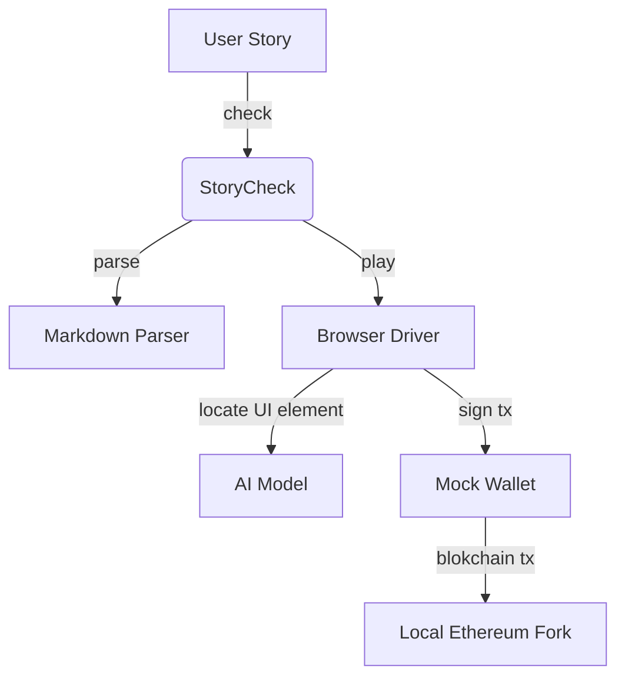

# StoryCheck

StoryCheck for Web3 apps. Provides a web app playground as well as an API. Both served via Gradio on port 7860.

It takes as input markdown formatted user stories
with steps written in natural language.
Then it parses the text and executes the steps in a virtual web browser
closely emulating
the actions of a real user.

## Example User Story

```md
# Swapping ETH for DAI on Uniswap

## Starting Context

- Chain name: Ethereum Mainnet
- Block number: 16848466
- User crypto wallet holds:
  - 0.11 ETH

## User Steps

1. Go to https://app.uniswap.org
2. Click on Connect Wallet
3. ...swap ETH for DAI steps...

## Expected results

- User crypto wallet holds:
  - 0.1 ETH
  - 210 DAI
```

## High level design




## Directory structure

```ml
├─ .\ — "Main StoryCheck python app."
│  │  
│  ├─ browser — "Playwright browser driver."
│  │  │
│  │  ├─ mock_wallet — "JavaScript mock wallet provider injected in playwright page context as Metamask."
│  │  
│  ├─ ai — "AI model that predicst UI element location based on natural language referring expressions."
│  │  
│  ├─ blockchain — "Local EVM fork runtime via Foundry Anvil."
│  │  
│  ├─ markdown — "Markdown parser."
│  │  
│  ├─ examples — "Example user stories."
```
