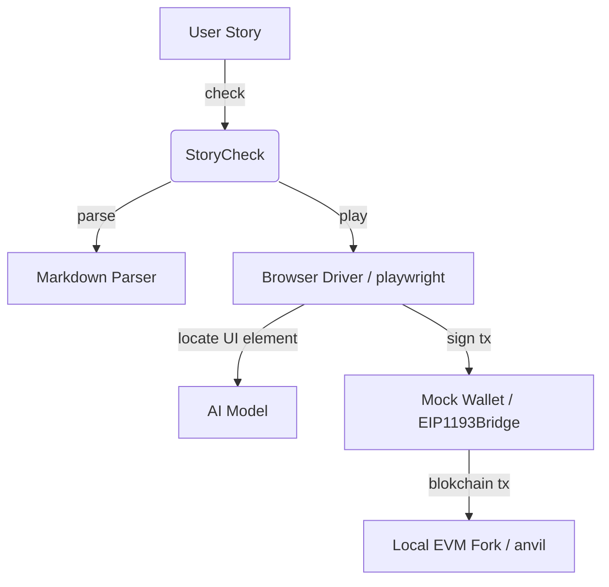

# StoryCheck

StoryCheck for Web3 apps based on Ethereum. Experimental app testing playground as well as an API served via [Gradio](https://github.com/gradio-app/gradio) on port `7860`.

StoryCheck promotes smooth collaboration between dApp developers, testers, document writers, product managers and support teams by enabling use of natural language for executable and verifiable user stories. StoryCheck reduces the need for expertise in low level e2e test frameworks such as Synpress, Cypress, Playwright, Selenium, etc.

StoryCheck takes as input markdown formatted user stories with steps written in natural language.
Then it parses the text and executes the steps in a virtual web browser (via Playwright) closely emulating the actions of a real user.
Uses SOTA VLM to understand and execute UI instructions.

## Walkthrough Video

[](https://www.youtube.com/watch?v=gZ23iDqlfX4)

## Example User Story Input

```md
# Creating a new DAO LLC via SporosDAO.xyz on Goerli Test Net

## Prerequisites

- Chain
  - Id 5
  - Block 8856964

## User Steps

1. Browse to https://app.sporosdao.xyz/
1. Click on Create a new company button
1. Click on Go! right arrow button left of Available
1. Select On-chain name text field
1. Type Test DAO
1. Select Token Symbol text field
1. Type TDO
1. Click on Continue button in the bottom right corner
1. Select Address text field above Enter the wallet address
1. Type 0x5389199D5168174FA177908685FbD52A7138Ed1a
1. Select text field below Initial Tokens
1. Type 1200
1. Select text field under Email
1. Type test@email.com
1. Scroll down
1. Click on Continue button
1. Click on Continue button at the top
1. Scroll up
1. Click on the checkbox left of Agree
1. Scroll down
1. Click on Continue button
1. Scroll up
1. Click on Deploy Now button
1. Press Tab
1. Press Tab
1. Press Enter
1. Press Home

## Expected Results

- Wallet transactions match snapshot
```

## Prerequisites Section

The prerequisites section sets conditions which allow the test to execute from a deterministic blockchain state, which respectively allows for predictable results. Currently supported prerequsite is `Chain` at the top level with `Id` as a required parameter, and optionally `Block` and `RPC`. These parameters are passed to `anvil` to create a local EVM fork for the test run.

### Default Prerequisites

By default each test starts with `10,000 ETH` in the mock user wallet (same as anvil default test accounts).

In order to fund the mock wallet with other tokens (e.g. USDC, DAI, NFTs), the `User Steps` section of the story file should begin with prompts that initiate the funding via front end interactions (e.g. Uniswap flow for ETH/USDC swap).

### Custom RPC

Often Web3 Apps use front end libraries such as [wagmi.sh](https://wagmi.sh/react/getting-started) to access current chain state. When that is the case, the user story should include the exact RPC URL used by the front end as a prerequisite. That allows StoryCheck to intercept all calls directed to the RPC and reroute towards the local blockchain fork. This is important to ensure that the app reads and writes from/to the local chain fork.

### Example 1. Etheremum Mainnet test

The following example sets up a local fork of ETH Mainnet starting from the latest block using a default RPC.

```markdown
## Prerequisites

- Chain
  - Id 1
```

### Example 2. Goerli test with specific block and RPC

The following example sets up a local fork of Goerli Testnet starting from the given block number and using a given RPC URL.

```markdown
## Prerequisites

- Chain
  - Id 5
  - Block 8856964
  - RPC https://eth-goerli.g.alchemy.com/v2/3HpUm27w8PfGlJzZa4jxnxSYs9vQNMMM
```

## User Story Section

The format of user steps in this section resembles the HOWTO documentation of a web3 app. Teams may use the same markdown in their documentation (e.g. gitbook, notion, docusauros) and execute it with StoryCheck to make sure that the latest web app behavior is in sync with docs.

## User Story Prompts

Each step in a user story is classified as an action prompt from the following set:

- `Browse` - prompts that start with `browse` and include a URL link to a web page are interpreted as browser navigation actions. For example `browse to https://app.uniswap.org`. For implementation details, see [Playwright goto](https://playwright.dev/python/docs/api/class-page#page-goto).
- `Click` - prompts that start with `click`, `tap`, or `select` followed by a natural language referring expression of a UI element are interepreted as click actions with the corresponding UI element target. For example `click on Submit button at the bottom` or `select logo next to ETH option`. For implementation details see [Playwright mouse click](https://playwright.dev/python/docs/input#mouse-click) and [RefExp GPT](https://huggingface.co/spaces/GuardianUI/ui-refexp-click)
- `Type` - prompts that start with the keyword `type`, `input` or `enter` (case insensitive) followed by a string are interpreted as a keyboard input action. For example `Type 1000` or `Type MyNewDAO`. For implementation details, see [Playwright type](https://playwright.dev/python/docs/api/class-keyboard#keyboard-type).
- `Scroll` - prompts that start with `scroll` followed by `up` or `down` are interpreted respectively as `Press PageDown` and `Press PageUp`
- `Press` - prompts that start with `press` followed by a keyboard key code (`F1` - `F12`, `Digit0` - `Digit9`, `KeyA` - `KeyZ`, `Backquote`, `Minus`, `Equal`, `Backslash`, `Backspace`, `Tab`, `Delete`, `Escape`, `ArrowDown`, `End`, `Enter`, `Home`, `Insert`, `PageDown`, `PageUp`, `ArrowRight`, `ArrowUp`) are interpreted as a single key press action. For further details, see [Playwright press](https://playwright.dev/python/docs/api/class-keyboard#keyboard-press).

## Expected Results Section

Expected Results section currently implements a default transaction snapshot check similar to [jest snapshot matching](https://jestjs.io/docs/snapshot-testing).
The first time a test is run, all write transactions going through `window.ethereum` are recorded and saved. Subsequent runs must match these write transactions. If there is a mismatch, then one of three changes took place in the UI under test:

- Developers changed the frontend code in a significant way. This warrants a careful code review and update of the user stories.
- There is malicious injected code that changes the behavior of the app. A big **red alert** is in order! App infrastructure is compromised: hosting providers, third party libraries, or build tools.
- There is a bug in some of the third party dependencies that affects UI behavior. Developer attention required to track down and fix the root cause.

### Saved Snaphots

Snapshot files with wallet transactions are saved to a file with `.snapshot.json` extension in the same directory where the story markdown file is stored.

```ml
├─ astory.md
├─ astory.snapshot.json
```

## Overview and Architecture

StoryCheck has the following high level architecture:

1. StoryCheck users rely on frontier models (Grok, Gemini, ChatGPT, Claude) and their favorite IDE to prepare user docs in a markdown format that is easy to parse and execute via steps 2-3 below.
2. StoryCheck uses SOTA VLM (Jedi-3B quantized as of July 2025) for UI component referencing and action expressions ("Click on the Connect button", "Type 20 in the Sell text field", "Enter rETH in search bar"). 
  - This choice of AI model strikes a balance between performance (1-2 sec per expression on laptop with GPU / Macbook M3/M4 and 3-5 sec on CPU, e.g. github actions CI environment).
3. StoryCheck uses fast and simple interpreter to iterate over markdown formatted steps of UI instructions and pass on to VLM for translation to Playwright function calls. 
  - We could use an LLM to parse a whole user story, but it would add significant runtime overhead. We are looking to strike a balance between natural language flexibility with high performance test execution in development and CI workflows.




## Directory structure

```ml
├─ .\ — "Main StoryCheck python app."
│  │
│  ├─ markdown — "Markdown parser. Outputs abstract syntax tree (AST) to interpreter."
│  │
│  ├──┬─ interpreter — "Runtime engine which takes AST as input and executes it."
│  │  │
│  ├──┼──┬─ browser — "Playwright browser driver."
│  │  │  │
│  │  │  └─ mock_wallet — "JavaScript mock wallet provider injected in playwright page context as Metamask."
│  │  │
│  │  ├─ ai — "RefExp GPT AI model that predicst UI element location based on natural language referring expressions."
│  │  │
│  │  └─ blockchain — "Local EVM fork runtime via Foundry Anvil."
│  │
│  └─ examples — "Example user stories."
```

## How to Build and Run

### Local Setup with uv (Recommended for Fast Environment Management)
To set up the environment locally using `uv` (a fast Python package manager), run the following script. This creates a virtual environment with Python 3.10, installs dependencies from `requirements.txt`, sets up Playwright, and builds the mock wallet.

```bash
chmod +x setup_env.sh
./setup_env.sh
source .venv/bin/activate

### Command line arguments

StoryCheck can be run as a shell command or as a web service.

```bash
$>./storycheck.sh --help


usage: StoryCheck by GuardianUI [-h] [-o OUTPUT_DIR] [--serve] storypath

Parses and executes user stories written in markdown format.

positional arguments:
  storypath             Path to the user story input markdown file (e.g. mystory.md).

options:
  -h, --help            show this help message and exit
  -o OUTPUT_DIR, --output-dir OUTPUT_DIR
                        Directory where all results from the storycheck run will be stored. Defaults to "results"
  --serve               Run as a web service. Defaults to "False".

Copyright(c) guardianui.com 2023
```

For example to run a check of mystory.md, use:

```sh
./storycheck.sh mystory.md
```

### Command line exit codes

If all story checks / tests pass, the command will return with exit code `0`. Otherwise if any test fails or other errors occur, the exit code will be non-zero.
This makes it possible to use storycheck in shell scripts or CI scripts.

## Using in CI scripts

StoryCheck can be used as a test step in CI scripts. Here is an [example github action](https://github.com/GuardianUI/storycheck/blob/main/.github/workflows/main.yml) which sets up a storycheck environment and runs checks. If the storycheck step fails, the CI script fails as well.

## Output Directory Artifacts

The output directory of a test run is either specified via `--output-dir` command line argument
or defaults to `./results`. It contains a number of helpful artifacts for debugging:

```ml
├─ ./results — "Main output directory for an input story file."
│  │
│  ├─ storycheck.log — "Consolidated log file between test runner, browser and EVM."
│  │
│  ├─ tx_log_snapshot.json — "Snapshot of all blockchain write transactions."
│  │
│  ├─ videos/ — "Video recordings of browser interactions."
│  │
│  ├─ screenshots/ — "Browser screenshot for every prompt in the User Steps section."
│  │
│  ├─ anvil-out.json — "Configuration for the anvil EVM fork."
│  │
│  ├─ trace.zip — "Session trace for Playwright Trace Viewer."
│  │
```

## Contributing

Thanks for your interest in contributing!

Please start with a [new discussion](https://github.com/GuardianUI/storycheck/discussions) before opening an Issue or Pull Request.
