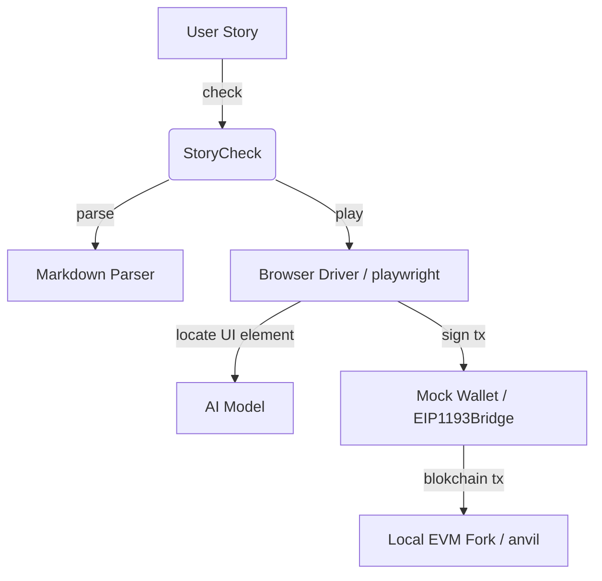

# StoryCheck

StoryCheck for Web3 apps based on Ethereum. Experimental app testing playground as well as an API served via [Gradio](https://github.com/gradio-app/gradio) on port `7860`.

It takes as input markdown formatted user stories with steps written in natural language.
Then it parses the text and executes the steps in a virtual web browser (via Playwright) closely emulating the actions of a real user.
Uses [RefExp GPT](https://huggingface.co/spaces/GuardianUI/ui-refexp-click) to predict UI element coordinates given a referring expression.

Note: Storycheck is currently most reliable for testing the UI of smartphones and tablets.

## Walkthrough Video

[](https://www.youtube.com/watch?v=gZ23iDqlfX4)

## Example User Story Input

```md
# Creating a new DAO LLC on Arbitrum One via SporosDAO.xyz

## Prerequisites

- Chain
  - Id 42161
  - Block 82121263

## User Steps

1. Browse to https://app.sporosdao.xyz/
1. Click on Connect Wallet in the top right corner
1. Click on circle icon in the top right corner
1. Click on Create a new company button
1. Click on Go! right arrow button left of Available
1. Select On-chain name text field
1. Type Test DAO
1. Select Token Symbol text field
1. Type TDO
1. Click on Continue button in the bottom right corner
1. Select Address text field above Enter the wallet address
1. Type 0x5389199D5168174FA177908685FbD52A7138Ed1a
1. Select text field below Initial Tokens
1. Type 1200
1. Select text field under Email
1. Type test@email.com
1. Scroll down
1. Click on Continue button
1. Click on Continue button right of Back button
1. Scroll up
1. Click on the checkbox left of Agree
1. Scroll down
1. Click on Continue button
1. Scroll up
1. Click on Deploy Now button

## Expected Results

- Wallet transactions match snapshot
```

## Prerequisites Section

The prerequisites section sets conditions which allow the test to execute from a deterministic blockchain state, which respectively allows for predictable results. Currently supported prerequsite is `Chain` at the top level with `Id` as a required parameter, and optionally `Block` and `RPC`. These parameters are passed to `anvil` to create a local EVM fork for the test run.

### Example 1. Etheremum Mainnet test

The following example sets up a local fork of ETH Mainnet starting from the latest block using a default RPC.

```markdown
## Prerequisites

- Chain
  - Id 1
```

### Example 2. Goerli test with specific block and RPC

The following example sets up a local fork of Goerli Testnet starting from the given block number and using a given RPC URL.

```markdown
## Prerequisites

- Chain
  - Id 5
  - Block 8856964
  - RPC https://eth-goerli.g.alchemy.com/v2/3HpUm27w8PfGlJzZa4jxnxSYs9vQNMMM
```

## User Story Section

The format of user steps in this section resembles the HOWTO documentation of a web3 app. Teams may use the same markdown in their documentation (e.g. gitbook, notion, docusauros) and execute it with StoryCheck to make sure that the latest web app behavior is in sync with docs.

## Expected Results Section

Expected Results section currently implements a default transaction snapshot check similar to [jest snapshot matching](https://jestjs.io/docs/snapshot-testing).
The first time a test is run, all write transactions going through `window.ethereum` are recorded and saved. Subsequent runs must match these write transactions. If there is a mismatch, then one of three changes took place in the UI under test:

- Developers changed the frontend code in a significant way. This warrants a careful code review and update of the user stories.
- There is malicious injected code that changes the behavior of the app. A big **red alert** is in order! App infrastructure is compromised: hosting providers, third party libaries, or build tools.
- There is a bug in some of the third party dependencies that affects UI behavior. Developer attention required to track down and fix the root cause.

## High level design



## Directory structure

```ml
├─ .\ — "Main StoryCheck python app."
│  │
│  ├─ markdown — "Markdown parser. Outputs abstract syntax tree (AST) to interpreter."
│  │
│  ├──┬─ interpreter — "Runtime engine which takes AST as input and executes it."
│  │  │
│  ├──┼──┬─ browser — "Playwright browser driver."
│  │  │  │
│  │  │  └─ mock_wallet — "JavaScript mock wallet provider injected in playwright page context as Metamask."
│  │  │
│  │  ├─ ai — "RefExp GPT AI model that predicst UI element location based on natural language referring expressions."
│  │  │
│  │  └─ blockchain — "Local EVM fork runtime via Foundry Anvil."
│  │
│  └─ examples — "Example user stories."
```

## How to Build and Run

This project is pre-configured to build and run via Gitpod.

[](https://gitpod.io/#https://github.com/GuardianUI/storycheck)

To run locally or in another dev environment, copy the steps from [`.gitpod.yml`](.gitpod.yml)

### Command line arguments

StoryCheck can be run as a shell command or as a web service.

```bash
$>python3 app.py --help


usage: StoryCheck by GuardianUI [-h] -i INPUT_FILE [-o OUTPUT_DIR] [--serve]

Parses and executes user stories written in markdown format.

options:
  -h, --help            show this help message and exit
  -i INPUT_FILE, --input-file INPUT_FILE
                        path to the user story input markdown file (e.g. story.md)
  -o OUTPUT_DIR, --output-dir OUTPUT_DIR
                        directory where all results from the storycheck will be stored.
  --serve               whether to start as a web service or run storycheck and exit.

Copyright (c) guardianui.com 2023
```

## Contributing

Thanks for your interest in contributing!

Please start with a [new discussion](https://github.com/GuardianUI/storycheck/discussions) before opening an Issue or Pull Request.
