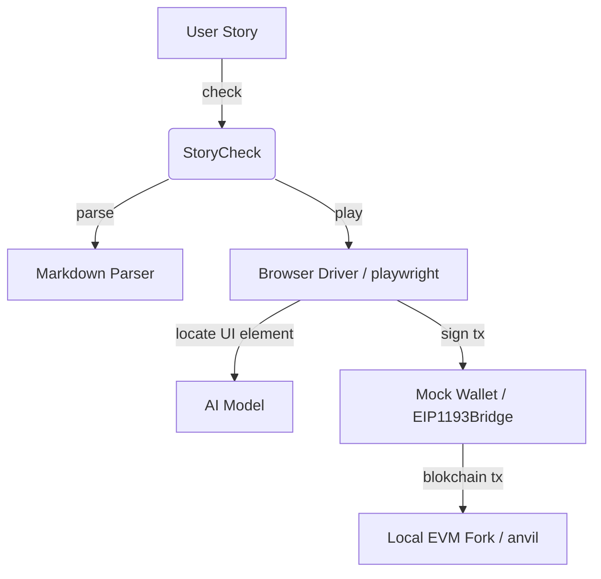

# StoryCheck

## What is StoryCheck

StoryCheck enables end-to-end natural language user story verification for Web3 apps.

StoryCheck promotes smooth collaboration between dApp developers, testers, document writers, product managers and support teams by enabling use of natural language for executable and verifiable user stories. StoryCheck reduces the need for expertise in lower level e2e test frameworks and brittle test code such as Synpress, Cypress, Playwright, Selenium, etc. Brittle UI testing code often leads to poor return on invested effort, which leaves front ends vulnerable to exploits. StoryCheck changes that by focusing on UX intention and stable UI flows rather than detailed CSS and HTML inspection.

Typical Workflow:
1. dApp Builders collaborate with frontier AI models to generate user stories in markdown format. The format includes pre-requisites such as chain ID, UI steps and expected results for blockchain transactions.
  - Use this [AI Story Ideation Prompt Template](./ai_story_ideation_template.md) for sessions with Grok or similar models.
1. StoryCheck parses user stories and executes the steps in a virtual web browser (via Playwright) closely emulating the actions of a real user. Uses SOTA VLM (Jedi-3B) to understand and execute UI instructions.
  - StoryCheck injects in the browser a mock wallet which intercepts and redirects UI transaction requests to a local EVM fork (via anvil).
  - As long as the user story intention remains stable, StoryCheck will remain robust to minor stylistic UI component and layout changes.
1. Finally StoryCheck verifies blochain transactions against expected results. Frontier model generates expected results description and verifier code at ideation time. Since blockchain code is strictly deterministic, verifier code remains stable as long as dApp user story intention remains stable.

StoryCheck's north star 🌟: becoming the default tool for Ethereum dApp e2e testing and documentation by blending frontier AI for creative/ideation phases with efficient local models for repetitive execution. This ensures developers save time on story generation (via collaborative Grok/Gemini/ChatGPT/Claude sessions) while enabling low-cost, automated CI/CD checks using efficient small AI models to boost ecosystem security and adoption.

## Why Now?

When the project was originally founded in 2023, dApp developers were mainly focused on smart contract security. However since then front end hacks have become more prominent culminating with a $1.5B hack of Bybit protocol due to javascript injected malicious code in the Safe multisig front end which almost all projects use to manage their treasuries and have therefore been vulnerable to the same hack. StoryCheck is now relevant more than ever as serious institutional funds are pouring into the Ethereum ecosystem even surpassing Bitcoin ETF inflows in July 2025.

## State of the Art VLM

To get a sense of the capability of modern local VLMs, try the following [UI referencing playground](https://huggingface.co/spaces/tianbaoxiexxx/Jedi)


## Example User Story Input

```md

# Register a new ENS domain

This use story walks through an initial domain name search "storychecktest" and successful registration on a mobile device.

## Prerequisites

1. Chain
   - Id 1
   - RPC https://lb.drpc.org/ogrpc?network=ethereum&dkey=****
   - Block 23086523   
2. Browser
   - Pixel 7

## User Steps

1. Browse to https://app.ens.domains/
1. Click Accept
1. Click on search box
1. Type storychecktest
1. Press Enter
1. Click Connect
1. Click Browser Wallet
1. Scroll down
1. Select Ethereum payment method
1. Click Next
1. Click Skip Profile
1. Scroll down
1. Click Begin
1. Click "Open Wallet"
1. Wait 5 seconds

## Expected Results

- Verify commitment transaction succeeded [verifier](verifiers/tx_success.py)
- Verify commitment timestamp set [verifier](verifiers/commitment_timestamp.py)
- App should display 'Transaction Successful' [verifier](verifiers/ui_start_timer_ok.py)


```

## Prerequisites Section

The prerequisites section sets conditions which allow the test to execute from a deterministic blockchain state, which respectively allows for predictable results. Currently supported prerequsite is `Chain` at the top level with `Id` as a required parameter, and optionally `Block` and `RPC`. These parameters are passed to `anvil` to create a local EVM fork for the test run.

### Default Prerequisites

By default each test starts with `10,000 ETH` in the mock user wallet (same as anvil default test accounts).

In order to fund the mock wallet with other tokens (e.g. USDC, DAI, NFTs), the `User Steps` section of the story file should begin with prompts that initiate the funding via front end interactions (e.g. Uniswap flow for ETH/USDC swap).

### Custom RPC

Often Web3 Apps use front end libraries such as [wagmi.sh](https://wagmi.sh/react/getting-started) to access current chain state. When that is the case, the user story should include the exact RPC URL used by the front end as a prerequisite. That allows StoryCheck to intercept all calls directed to the RPC and reroute towards the local chain fork. This is important to ensure that the app reads and writes from/to the local chain fork.

## User Story Section

The format of user steps in this section resembles the HOWTO documentation of a web3 app. Teams may use the same markdown in their documentation (e.g. gitbook, notion, docusauros) and execute it with StoryCheck to make sure that the latest web app behavior is in sync with docs.

## User Story Prompts

Each step in a user story is classified as an action prompt from the following set:

- `Browse` - prompts that start with `browse` and include a URL link to a web page are interpreted as browser navigation actions. For example `browse to https://app.uniswap.org`. For implementation details, see [Playwright goto](https://playwright.dev/python/docs/api/class-page#page-goto).
- `Click` - prompts that start with `click`, `tap`, or `select` followed by a natural language referring expression of a UI element are interepreted as click actions with the corresponding UI element target. For example `click on Submit button at the bottom` or `select logo next to ETH option`. For implementation details see [Playwright mouse click](https://playwright.dev/python/docs/input#mouse-click) and [RefExp GPT](https://huggingface.co/spaces/GuardianUI/ui-refexp-click)
- `Type` - prompts that start with the keyword `type`, `input` or `enter` (case insensitive) followed by a string are interpreted as a keyboard input action. For example `Type 1000` or `Type MyNewDAO`. For implementation details, see [Playwright type](https://playwright.dev/python/docs/api/class-keyboard#keyboard-type).
- `Scroll` - prompts that start with `scroll` followed by `up` or `down` are interpreted respectively as `Press PageDown` and `Press PageUp`
- `Press` - prompts that start with `press` followed by a keyboard key code (`F1` - `F12`, `Digit0` - `Digit9`, `KeyA` - `KeyZ`, `Backquote`, `Minus`, `Equal`, `Backslash`, `Backspace`, `Tab`, `Delete`, `Escape`, `ArrowDown`, `End`, `Enter`, `Home`, `Insert`, `PageDown`, `PageUp`, `ArrowRight`, `ArrowUp`) are interpreted as a single key press action. For further details, see [Playwright press](https://playwright.dev/python/docs/api/class-keyboard#keyboard-press).
- `Wait` - prompts that start with `wait` followed by a number and `seconds` or `minutes` result in a pause that is useful when the web3 app UI is awaiting blockchain confirmation.

## Expected Results Section

Expected Results section provides several ways to check the results of running a user story.

### Snapshot check

StoryCheck saves a transaction snapshot check similar to [jest snapshot matching](https://jestjs.io/docs/snapshot-testing).
The first time a test is run, all write transactions going through `window.ethereum` are recorded and saved. Subsequent runs must match these write transactions. 
If there is a mismatch, then one of three changes took place in the UI under test:

- Developers changed the frontend code in a significant way. This warrants a careful code review and update of the user stories.
- There is malicious injected code that changes the behavior of the app. A big **red alert** is in order! App infrastructure is compromised: hosting providers, third party libraries, or build tools.
- There is a bug in some of the third party dependencies that affects UI behavior. Developer attention required to track down and fix the root cause.

### Verifiers

Sometimes web3 apps use randomization (e.g. ENS registration commit step), which makes snapshots different on each run. In this case and generally when more advanced verification is needed, 
StoryCheck allows custom verifiers. Usually frontier models are very good at understanding the intention of user stories, suggesting and implementing custom verifiers.
As long as the intended behavior of a user story remains stable in relation to onchain transactions, the verifiers code also remains robust. Inherently blockchain code is a lot more robust and stable across app iterations than UI code.

Verifiers are referenced in the **Expected Results** section of a `story.md` file and saved under `/verifiers` sub directory.

```ml
├─ astory/
   │
   ├─story.md
   │
   ├─/verifiers
```

## Overview and Architecture

StoryCheck has the following high level workflow:

1. StoryCheck power user uses a frontier models (Grok, Gemini, ChatGPT, Claude) and their favorite IDE to prepare verifiable user stories in sync with project docs in a markdown format that is easy to parse and execute via steps 2-3 below.
  - Ideation prompt template available at [ai_story_ideation_template.md](ai_story_ideation_template.md)
1. Stories are executed and verified in three stages:
  a. Prerequisites: prepare local context with EVM fork, virtual web browser and mock crypto wallet
  a. User steps: UI commands are parsed with a local AI model and run through virtual browser. ("Click on the Connect button", "Type 20 in the Sell text field", "Enter rETH in search bar"). 
  a. Expected Results: finally, verifiers inspect app and chain state.




## Directory structure

```ml
├─ .\ — "Main StoryCheck python app."
│  │
│  ├─ markdown — "Markdown parser. Outputs abstract syntax tree (AST) to interpreter."
│  │
│  ├──┬─ interpreter — "Runtime engine which takes AST as input and executes it."
│  │  │
│  ├──┼──┬─ browser — "Playwright browser driver."
│  │  │  │
│  │  │  └─ mock_wallet — "JavaScript mock wallet provider injected in playwright page context as Metamask."
│  │  │
│  │  ├─ ai — "RefExp GPT AI model that predicst UI element location based on natural language referring expressions."
│  │  │
│  │  └─ blockchain — "Local EVM fork runtime via Foundry Anvil."
│  │
│  └─ examples — "Example user stories."
```

## How to Build and Run

### Local Setup with uv (Recommended for Fast Environment Management)
To set up the environment locally using `uv` (a fast Python package manager), run the following script. This creates a virtual environment with Python 3.10, installs dependencies from `requirements.txt`, sets up Playwright, and builds the mock wallet.

```bash
chmod +x setup_env.sh
./setup_env.sh
source .venv/bin/activate
```

### Command line arguments

StoryCheck can be run as a shell command or as a web service.

```bash
$>./storycheck.sh --help


usage: StoryCheck by GuardianUI [-h] [-o OUTPUT_DIR] [--serve] storypath

Parses and executes user stories written in markdown format.

positional arguments:
  storypath             Path to the user story dir (e.g. mystory/).

options:
  -h, --help            show this help message and exit
  -o OUTPUT_DIR, --output-dir OUTPUT_DIR
                        Directory where all results from the storycheck run will be stored. Defaults to "results"
  --serve               Run as a web service. Defaults to "False".

Copyright(c) guardianui.com 2023
```

For example to run a check of mystory/, use:

```sh
./storycheck.sh mystory/
```

### Command line exit codes

If all story checks / tests pass, the command will return with exit code `0`. Otherwise if any test fails or other errors occur, the exit code will be non-zero.
This makes it possible to use storycheck in shell scripts or CI scripts.

## Output Directory Artifacts

The output directory of a test run is either specified via `--output-dir` command line argument
or defaults to `./results`. It contains a number of helpful artifacts for debugging:

```ml
├─ ./results — "Main output directory for an input story file."
│  │
│  ├─ storycheck.log — "Consolidated log file between test runner, browser and EVM."
│  │
│  ├─ tx_snapshot.json — "Snapshot of all blockchain write transactions."
│  │
│  ├─ videos/ — "Video recordings of browser interactions."
│  │
│  ├─ screenshots/ — "Browser screenshot for every prompt in the User Steps section."
│  │
│  ├─ anvil-out.json — "Configuration for the anvil EVM fork."
│  │
│  ├─ trace.zip — "Session trace for Playwright Trace Viewer."
│  │
```

## Using as a GitHub Action

You can integrate StoryCheck into your project's CI/CD workflow using the GitHub Action. This runs story checks automatically on pushes/pull requests, gating merges on pass/fail and uploading artifacts for review.

Example workflow (add to `.github/workflows/storycheck.yml` in your repo):

```yaml
name: StoryCheck CI

on:
  push:
    branches: [ main, dev ]
  pull_request:
    branches: [ main, dev ]

jobs:
  check:
    runs-on: ubuntu-latest
    steps:
      - uses: actions/checkout@v4
      - name: Run StoryCheck
        uses: GuardianUI/storycheck@v0.1.0  # Replace with your tagged version
        with:
          storypath: 'examples/sporosdao'  # Path to your story dir/file (relative to your repo)
          output-dir: 'storycheck-results'  # Optional: Custom output dir
      - name: Check if passed
        if: ${{ steps.storycheck.outputs.passed != 'true' }}
        run: echo "StoryCheck failed!" && exit 1
```

### Starting a Local App in the Workflow

If your web3 app needs to run locally during the check (e.g., for testing against a dev server), use these optional inputs:
- `start-command`: Command to start the app (e.g., `yarn workspace @my-app start`).
- `wait-on`: URL to poll until ready (e.g., `http://localhost:3000`).
- `wait-on-timeout`: Timeout in seconds (default: 60).
- `app-working-directory`: Directory for the start command (relative to your repo, default: `.`).

The action starts the app in the background, waits for the URL to respond with 200 OK, runs StoryCheck (ensure your story.md uses local URLs like `Browse to http://localhost:3000/`), then stops the app. App logs are captured in `app.log` and uploaded as part of artifacts.

Example workflow to test a simple web3 app that sends ETH to a user-entered ENS name or address:

```yaml
name: StoryCheck Simple Web3 App

on:
  push:
    branches: [main, dev]
  pull_request:
    branches: [main, dev]

jobs:
  check:
    runs-on: ubuntu-latest
    steps:
      - uses: actions/checkout@v4
      - name: Install pnpm dependencies
        run: pnpm install
        working-directory: examples/simple-web3-app
      - name: Run StoryCheck
        uses: GuardianUI/storycheck@v0.1.2  # Replace with the latest stable tagged version
        with:
          storypath: 'examples/simple-web3-app'
          start-command: 'pnpm dev'
          wait-on: 'http://localhost:5173'
          wait-on-timeout: '60'
          app-working-directory: 'examples/simple-web3-app'
      - name: Check if passed
        if: ${{ steps.storycheck.outputs.passed != 'true' }}
        run: echo "StoryCheck failed!" && exit 1
```

This example runs StoryCheck on the `simple-web3-app` example, which tests a web3 app that connects a wallet, allows entering an ENS name or address (e.g., `vitalik.eth`) and an ETH amount (e.g., 0.01), and sends the transaction. The user story (`examples/simple-web3-app/story.md`) includes steps like:

- Browse to http://localhost:5173/
- Click Connect Wallet
- Type vitalik.eth in the ENS name or address input
- Type 0.01 in the ETH amount input
- Click Send ETH
- Wait 5 seconds
- Transaction succeeded with 0.01 ETH sent to vitalik.eth resolving to 0xd8dA6BF26964aF9D7eEd9e03E53415D37aA96045 - [verifier](verifiers/tx_success.py)

The action starts the Vite dev server (`pnpm dev`), waits for `http://localhost:5173`, runs the story, and automatically uploads artifacts (including `app.log` and `results/`). The job fails if StoryCheck doesn’t pass.

## Contributing

Thanks for your interest in contributing!

Please start with a [new discussion](https://github.com/GuardianUI/storycheck/discussions) before opening an Issue or Pull Request.